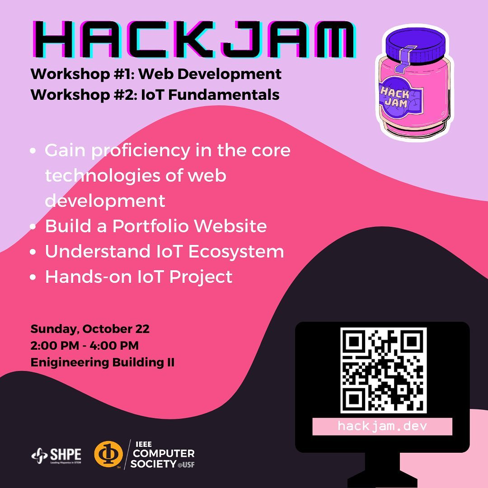

# How to Build a Portfolio Website

The web development workshop the IEEE Computer Society student branch chapter at the University of South Florida ran at HackJam, a 12 hour hackathon at USF. We taught two sessions that day, one on IoT and this one.

Sunday, October 22, 2023, ENB, Engineering Building II.

## What we covered

Building a portfolio site worth linking on a resume, aimed at people who had never shipped one. A hackathon is the right place for it, since everyone there is about to have a project that needs somewhere to live.

## Files

- `How to build a portfolio website.pptx`, the slides.

## Links

- [HackJam on Instagram](https://www.instagram.com/p/CymP-e1xIqE/)
